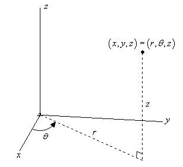
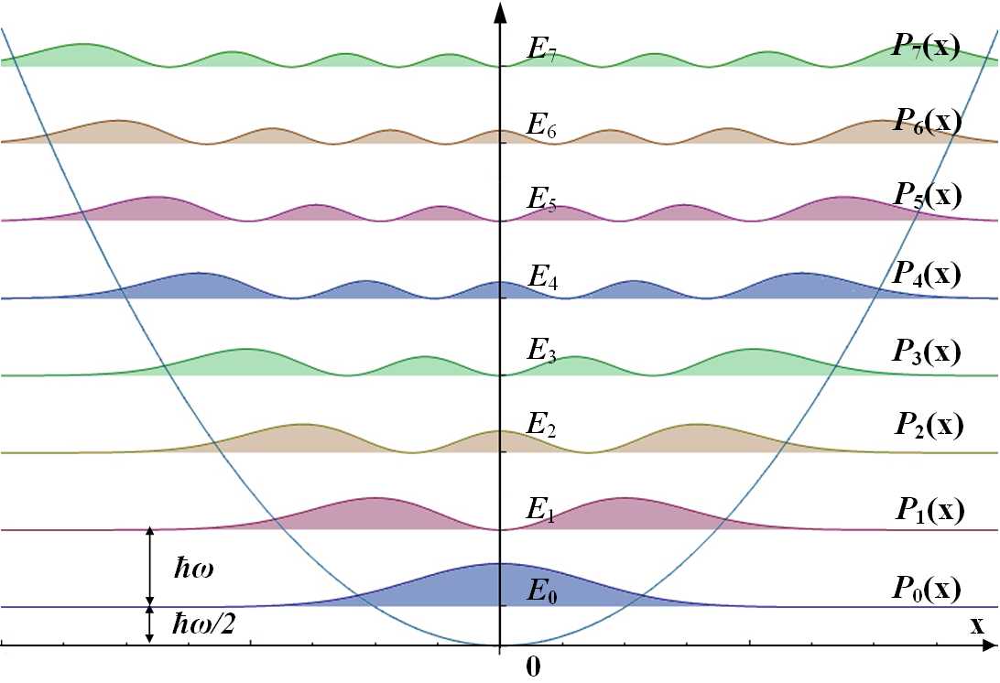
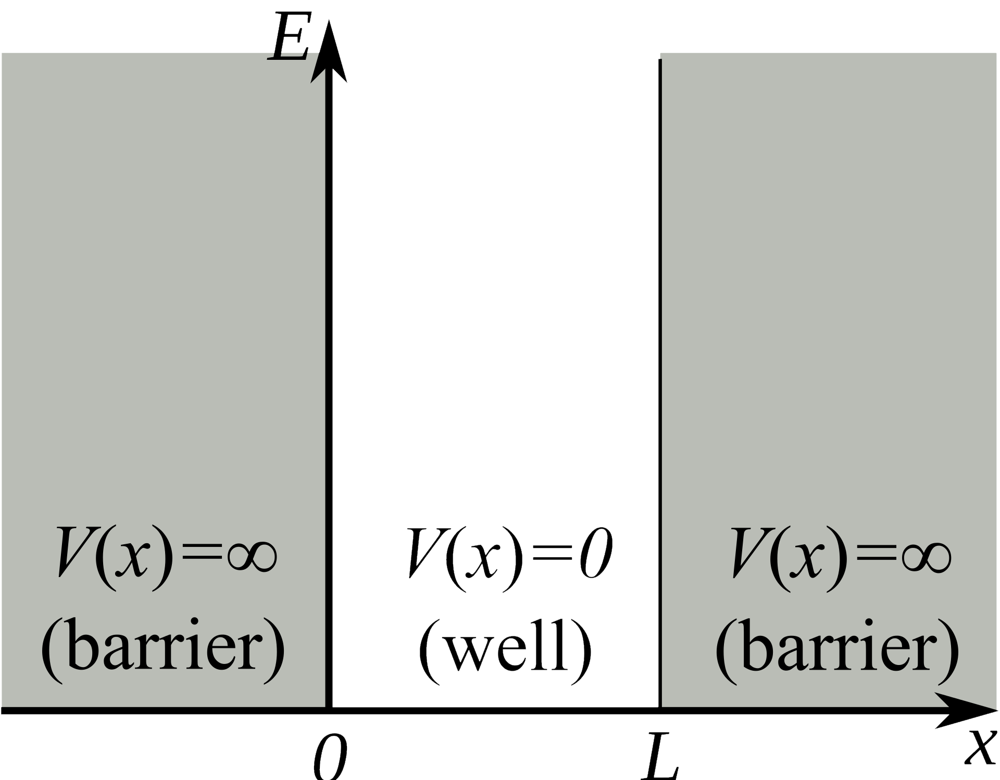

# PHYS Assignments
 
A collection of Physics assignments I've done in either Python or C++. A quick summary of the assignments:
 
 

# PHYS 234

## <em>Assignment 1</em>

$$
\begin{equation}
    \frac{df}{dx}(x)=\frac{f(x+\delta)-f(x)}{\delta}
\end{equation}
$$

<em>Objective.</em> Plot and calculate the numerical derivatives of a function $f(x)$ using different methods, such as the above equation. Compare numerical derivatives to the analytic derivative. Determine the smallest step $\delta$ that is still within the precision of a float.

## <em>Assignment 2</em>

The Biot-Savart law describes the magnetic field $\vec B$ produced by an electric current $I$ along a curve $\mathcal C$:
$$
\begin{equation}
    \vec B(\vec r)=\frac{\mu_0}{4\pi}\int_\mathcal C\frac{I d\vec l\times(\vec r-\vec r')}{|\vec r-\vec r'|^3},
\end{equation}
$$

where $\mu_0$ is a constant, $d\vec l$ is the differential current element, $\vec r$ is the location of interest to calculate the magnetic field, and $\vec r'$ is the position along the curve $\mathcal C$.   
<em>Objective.</em> Calculate the magnetic field produced by two Helmholtz coils (many coils of wire carrying current) at different points in space.

## <em>Assignment 3</em>

A position in cartesian three-space can be described in polar cylindrical coordinates by the following coordinate transformation:

$$
\begin{equation}
    \vec r=(x, y, z)=(r\cos\phi, r\sin\phi, z),
\end{equation}
$$

where $r=\sqrt{x^2+y^2}$ and $\tan\phi=y/x$. $\theta$ is sometimes also used as the azimuthal angle rather than $\phi$.

    

 
Likewise, the spherical coordinate coordinate transformation is:

$$
\begin{equation}
    \vec r=(x,y,z)=(r\cos\phi\sin\theta, r\sin\phi\sin\theta, r\cos\phi),
\end{equation}
$$

where $r=\sqrt{x^2+y^2+z^2}$, $\tan\theta=z/\sqrt{x^2+y^2}$, and $\tan\phi=y/x$.

    

The solid angle of an object in spherical coordinates is defined as

$$
\begin{equation}
    \Omega=\iint_\mathcal S \sin\theta\ d\theta\ d\phi.
\end{equation}
$$

The solid angle is essentially the "area" that an object takes up within the sphere that you can view it:

    

 

<em>Objective.</em> For a cylinder that is displaced from the origin in three-space, find the integration limits of $\theta$ and $\phi$ to be used in the solid angle equation. Find the solid angle that this cylinder takes up using that equation.

## <em>Assignment 4</em>

The planets have an orbital period (<em>i.e.,</em> a year) about the sun that depends on the distance from the sun, the mass of the planet, the velocity of the planet, etc. Newton's Law of Gravity provides a set of coupled differential equations that describe the motion of a planet about the sun. When solved, these equations can tell us the length of a year. NASA's Horizon system provides data about planets (<em>e.g.,</em> mass) that can be used in Newton's Law of Gravity.  

<em>Objective.</em> Calculate the length of one year for Earth using Newton's Law of Gravity and data from the NASA Horizon system.

## <em>Assignment 5</em>

One of the earliest applications of Quantum Mechanics was solving the wavefunction for an electron in the hydrogen atom. The wavefunction $\Psi(x,t)$ describes where a particle is likely to be found in space. To find the wavefunction, the Schrodinger equation must be solved in three dimensions:

$$
\begin{equation}
    i\hbar\frac{\partial\Psi}{\partial t}=-\frac{\hbar^2}{2m}\nabla^2\Psi(x,t)+V(x,t),
\end{equation}
$$

where $i=\sqrt{-1}$, $\hbar$ is the reduced planck constant, $m$ is the mass of the particle, and $V(x,t)$ is the potential the particle is subject to. The Laplacian $\nabla^2$ is defined as

$$
\begin{equation}
    \nabla^2=\frac{\partial^2\ }{\partial x^2}+\frac{\partial^2\ }{\partial y^2}+\frac{\partial^2\ }{\partial z^2}.
\end{equation}
$$

For an electron in the hydrogen atom, the potential is just the Coloumb potential between the electron and proton in the atom:

$$
\begin{equation}
    V(x,t)=V(x)=-\frac{1}{4\pi\epsilon_0}\frac{e^2}{x^2+y^2+z^2},
\end{equation}
$$

where $\epsilon_0$ is a constant and $e$ is the elementary charge. After inserting this potential into the Schrodinger equation, the wavefunction for the electron can be solved for. The solutions give rise to three constants $n$, $l$, and $\lambda$ (or $m$), which can be varied to describe all the different electron orbitals of the hydrogen atom. Some of these orbitals are shown below.

    

<em>Objective. </em> Solve (numerically) the Schrodinger equation for an electron in the hydrogen atom and plot the different wavefunctions the electron can be described by.

## <em>Assignment 6</em>

In 1911, Ernest Rutherford shot alpha particles (a helium nucleus) at a sheet of gold foil. This is now known as Rutherford scattering. He found that some particles went straight through, some were scattered at an angle, and some bounced right back. The data he collected from these scattering experiments allowed him to estimate the size of the nucleus of a gold atom. The deflection of the alpha particle $q_1$ by the nucleus $q_2$ is due to the electrostatic Columb force:

$$
\begin{equation}
    \vec F_{12}=\frac{1}{4\pi\epsilon_0}\frac{q_1q_2}{|\vec r_1-\vec r_2|^3}(\vec r_1-\vec r_2).
\end{equation}
$$

Like Newton's Law of Gravity, this gives rise to a set of coupled differential equations which can be solved to find the trajectory of a scattered alpha particle.

An example of an alpha particle being scattered is shown below.

    

The Monte-Carlo technique in Physics is used to generate a distribution of some value (<em>e.g.,</em> position) which follows a given probability distribution (<em>e.g.,</em> a normal distribution).

<em>Objective. </em> Use a Monte-Carlo technique to generate a uniform distribution of methylene atoms in a small square. Again using a Monte-Carlo technique, throw alpha particles at the sheet of Methylene, and solve for the trajectory of the alpha particle as it heads toward the methylene sheet. Find the scattering angle of the alpha particle, and how much energy it loses.
 
 

# PHYS 372

## <em> Assignment 5</em>

The one-dimensional time-independent Schrodinger equation is defined as

$$
\begin{equation}
    i\hbar\frac{\partial\Psi}{\partial t}=-\frac{\hbar^2}{2m}\frac{\partial^2\ }{\partial x^2}\Psi(x,t)+V(x),
\end{equation}
$$

where $i=\sqrt{-1}$, $\hbar$ is the reduced Planck constant, $m$ is the mass of the particle, and $V(x)$ is the potential the particle is subject to. When solved, the Schrodinger equation yields a wavefunction $\Psi(x,t)$ which describes the particle.

The wavefunction $\Psi(x,t)$ of a particle can be represented as a linear combination of quantum states:

$$
\begin{equation}
    \Psi(x,t)=\sum_n c_n\psi_n(x)e^{-iE_nt/\hbar},
\end{equation}
$$

where $\psi_n(x)$ are the basis vectors used, $c_n$ is how much each basis vector contributes to the wavefunction, and $E_n$ is the energy associated with the basis vector. Given a wavefunction at $t=0$, $\Psi(x,0)$, the coefficients $c_n$ can be calculated as

$$
\begin{equation}
    c_n=\int\psi_n^*\Psi(x,0)\ dx.
\end{equation}
$$

A particle in the harmonic oscillator problem has a potential $V(x)=m\omega^2x^2/2$, where $\omega$ is the angular frequency of the particle (how fast it's oscillating). The potential is shown below.

    

Likewise, the infinite square well problem of width $a$ has a potential defined by

    

The potential is shown below.

    

 
<em>Objective. </em> Construct a potential by placing a harmonic oscillator inside of an infinite square well. Solve the Schrodinger equation in the basis of infinite square well eigenfunctions. Plot the resulting wavefunction against the wavefunction for a particle in the harmonic oscillator to see how much the square well affects the wavefunction.

 
 
<em>Note: I skipped over many details in the explanation here for the sake of brevity. The original paper by Dr. Frank Marsiglio in the corresponding folder can be read for further details.</em>
 
 

# PHYS 381

## <em> Assignment 5</em>

The Dirac delta function is (lazily) defined as

    

The Dirac delta function satisfies the integral property

    

The graph of the Dirac delta function looks like:

    

 
The origin of this function begins with the Gaussian curve:

$$
\begin{equation}
    f(x)=\frac{1}{\sqrt{2\pi\sigma}}\exp\left(-\frac{x^2}{2\sigma^2}\right),
\end{equation}
$$

where $\sigma$ describes the width of the curve. A smaller $\sigma$ means a tighter distribution, as shown below.

    

It is easy to see that as $\sigma$ approaches $0$, the Gaussian distribution becomes the Dirac delta function. <em>i.e.,</em>

$$
\begin{equation}
    \delta(x-x_0)=\lim_{\sigma\to 0} \frac{1}{\sqrt{2\pi\sigma}}\exp\left(-\frac{(x-x_0)^2}{2\sigma^2}\right),
\end{equation}
$$

which is the not-so-lazy definition.

The derivative of a function can be calculated using the Dirac delta function. Using integration by parts and considering the following integral,

$$
\begin{aligned}
    \int_a^b f(x)\frac{d\ }{dx}\delta(x-x_0)\ dx&=\underbrace{\left.f(x)\delta(x-x_0)\right|_a^b}_{=0}-\int_a^b\frac{df}{dx}\delta(x-x_0)\ dx \\
    &=-\int_a^b\frac{df}{dx}\delta(x-x_0)\ dx.
\end{aligned}
$$
 
Invoking the integral property,

    

Therefore, for any function $f(x)$, numerically integrating the function multiplied by a Gaussian with a narrow width centered about $x_0$ will yield the derivative of $f(x)$ at $x=x_0$.

<em>Objective. </em> Calculate the derivative of $f(x)=\sin(x)$ by numerically integrating the above equation.
